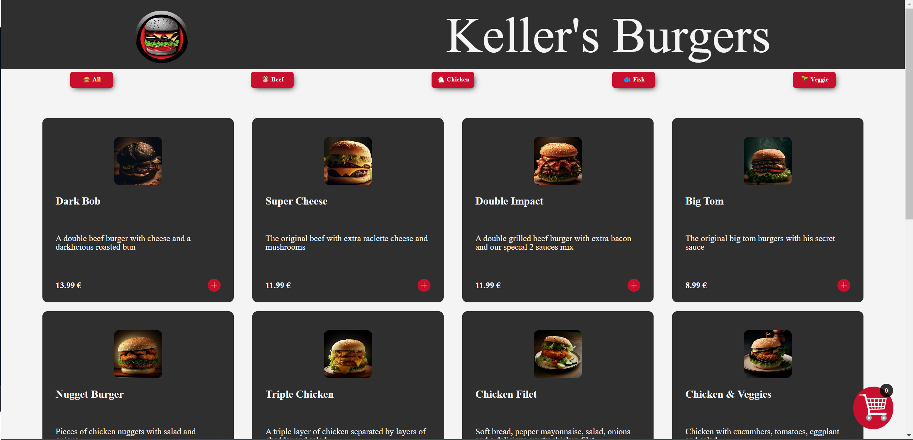

# Keller's burgers

You will be in charge of building a Dark Kitchen online delivery service. The site must a single page website, with the following features. 

- Create a list of dishes that people will order online.
- The website should be responsive, it should work on a standard mobile resolution and on desktop 
- You must list the food using some sort of card templates
- You should categorize your food to be able to filter it (ex: vegan, comfort food)
- You should create a `shopping cart` component to display the selected dishes and display the total amount of the delivery
- You should create a `dark mode` switch, to toggle your design between a `light` and a `dark` mode

## Screenshots

## Badges

## work progress

This project was made in September 2023 during a formation at BeCode. 
## Authors

- [@Virginie](https://github.com/vdourson2)
- [@Tom](https://github.com/tomboszko)
- [@Justin](https://github.com/JustinMichel2000)
- And me
